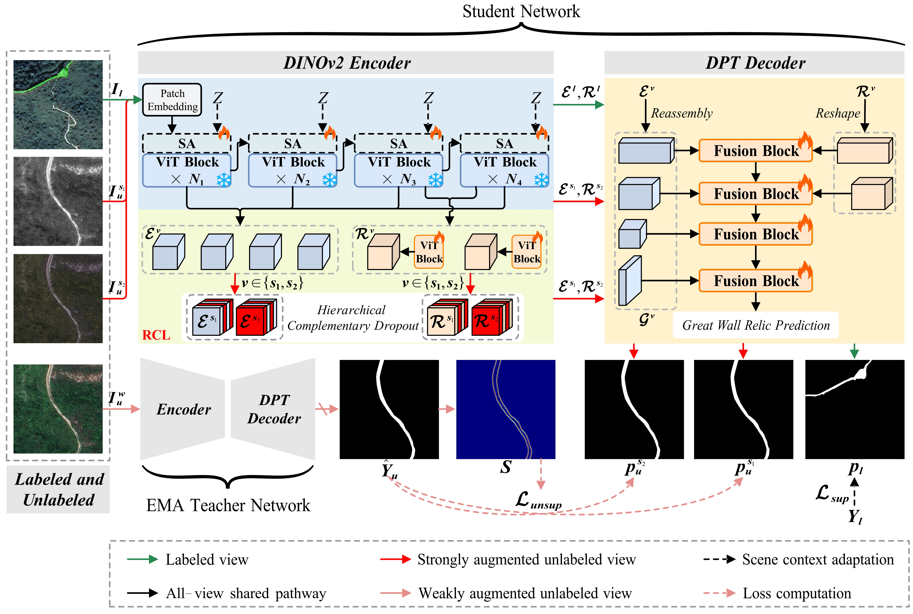
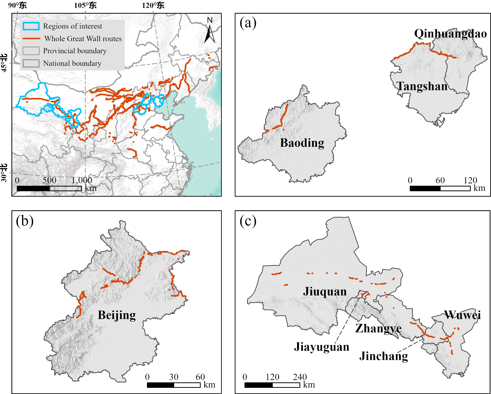

# SSGW

This repository contains the PyTorch implementation of  the paper **Semi-Supervised Great Wall Relic Trace Extraction via Scene-level Adapter and Relic-oriented Consistency Learning**, submitted to the *IEEE Journal of Selected Topics in Applied Earth Observations and Remote Sensing (JSTARS)*.

## 📢 News

- **[2026-09-16]** The training and evaluation code is prepared for release.
- **[2026-09-16]** The HB-GWR, BJ-GWR, and GS-GWR datasets are available on [Baidu Netdisk](https://pan.baidu.com/s/1xTcwGP0Q8Lm2HkfsPsW95Q?pwd=4ddt).
- **[2026-09-01]** The codes for our recent works, including [SGGWSeg](https://github.com/2022jiangjiazheng/SGGWSeg), [GWSegNet](https://github.com/labiao/GWSegNet), and [TFCL-Net](https://github.com/HariwW/TFCL-Net) are also publicly available.
- **[Coming Soon]** The dataset access will be released.

## 📝 Abstract

Accurate extraction of Great Wall relic traces is crucial for large-area archaeological investigation and heritage conservation. Recent semantic segmentation methods enable automated relic extraction from high-resolution remote sensing (RS) imagery, but their reliance on costly pixel-level annotations limits scalability. Semi-supervised segmentation model based on weak-to-strong consistency provides a promising solution by exploiting unlabeled RS images. However, diverse relic occurrence environments exhibit large scene variability between labeled and unlabeled  mages, while the weak and narrow characteristics of wall structures lead to unreliable feature-level consistency constraints. To address these challenges, we propose a semi-supervised Great Wall relic segmentation framework with two complementary adaptation mechanisms for improving relic scene  adaptation and feature consistency learning under limited annotation conditions. First, a scene-level adapter (SA) is integrated into the frozen DINOv2 encoder to capture scene context information and generate scene-adapted embeddings, improving the adaptability of the semi-supervised framework to diverse relic-bearing environments. Second, relic-oriented consistency learning (RCL) derives relic-oriented features through two trainable replicated Transformer blocks. For unlabeled images, hierarchical complementary dropout is applied to both scene-adapted and relic-oriented features to enforce feature-level consistency and improve the perception of weak and elongated relic traces. In addition, a contour-guided progressive reweighting strategy is introduced to incorporate contour information into the unsupervised loss, adaptively adjusting pseudo-label supervision for ambiguous relic  boundaries in unlabeled images.

## 🚀 Framework

<p align="center">
  
</p>
<p align="center">
  <em>Overall framework of the proposed method.</em>
</p>

## 📂 Dataset

The study areas include three representative Great Wall relic regions located in Hebei, Beijing, and Gansu provinces. The total lengths of the selected relic sections are approximately 300 km, 273 km, and 436 km in Hebei, Beijing, and Gansu, respectively.

<p align="center">
  
</p>
<p align="center">
  <em>Study areas and selected Great Wall relic sections.</em>
</p>

The included configuration and split files target the Beijing subset (BJ-GW). The loader expects the following layout:

```text
data/greatwall/
└── greatwall_beijing/
    ├── images/
    │   └── <sample>.png
    └── labels/
        └── <sample>_mask.png
```

Each line in a split file contains an image path and its mask path separated by a space. Both paths are relative to `data/greatwall/greatwall_beijing/`.

All three regional datasets are available in the shared SSGW folder on [Baidu Netdisk](https://pan.baidu.com/s/1xTcwGP0Q8Lm2HkfsPsW95Q?pwd=4ddt).

To use another local location, change `data_root` in `configs/gw.yaml`.

## 🛠️ Usage

### 1. Dependencies

Python 3.10, PyTorch 1.12.1, torchvision 0.13.1, and CUDA 11.3 were used for the current experiments:

```bash
conda create -n ssgw python=3.10 -y
conda activate ssgw

pip install torch==1.12.1+cu113 torchvision==0.13.1+cu113 \
  -f https://download.pytorch.org/whl/torch_stable.html
pip install -r requirements.txt
```

### 2. Pretrained Weights

Download the official DINOv2 ViT-S/14 checkpoint and place it at:

```text
pretrained/dinov2_small.pth
```

For example:

```bash
mkdir -p pretrained
wget https://dl.fbaipublicfiles.com/dinov2/dinov2_vits14/dinov2_vits14_pretrain.pth \
  -O pretrained/dinov2_small.pth
```

### 3. Training

`ssgw.py` is the semi-supervised training entry point for the proposed method.
The default command uses two GPUs and the included `10%_beijing` labeled/unlabeled split:

```bash
bash train.sh
```

Environment variables can override the defaults without editing the script:

```bash
CUDA_VISIBLE_DEVICES=0 NPROC_PER_NODE=1 SPLIT=10%_beijing \
SAVE_PATH=exp/gw/ssgw/10%_beijing bash train.sh
```

The included semi-supervised splits are `5%_beijing`, `10%_beijing`, and `20%_beijing`. Each split directory contains both `labeled.txt` and
`unlabeled.txt`.

`supervised.py` is retained as the fully supervised baseline. It can be run with:

```bash
CUDA_VISIBLE_DEVICES=0 NPROC_PER_NODE=1 SPLIT=100%_beijing \
SAVE_PATH=exp/gw/supervised/100%_beijing bash train_supervised.sh
```

### 4. Evaluation

Use `test.py` as the evaluation entry point:

```bash
python test.py \
  --config configs/gw.yaml \
  --model-path exp/gw/ssgw/10%_beijing/best.pth \
  --gpu 0 \
  --checkpoint-key auto
```

With `--checkpoint-key auto`, the evaluator uses `model_ema` from an SSGW semi-supervised checkpoint and falls back to `model` for a supervised checkpoint. Pass `--checkpoint-key model` or `--checkpoint-key model_ema` to select one explicitly. The evaluator also removes the `module.` prefix produced by distributed training.

For the current BJ-GW configuration, evaluation:

- reads the validation samples from `splits/gw/greatwall_beijing_val.txt`;
- runs single-GPU inference with a batch size of 1;
- reports class-wise IoU, precision, recall, and F1, together with mIoU and mean F1;
- writes binary prediction masks to `<checkpoint-directory>/pred/`.

## 📁 Repository Structure

```text
SSGW/
├── configs/gw.yaml                 # dataset, optimization, and model settings
├── dataset/                        # loader and augmentations
├── model/                          # DINOv2 backbone and DPT segmentation model
├── splits/gw/                      # BJ-GW train and validation lists
├── util/                           # losses, metrics, logging, and DDP setup
├── pretrained/                     # place DINOv2 weights here
├── ssgw.py                         # semi-supervised SSGW training entry point
├── supervised.py                   # fully supervised baseline
├── test.py                         # single-GPU evaluation entry point
├── train.sh                        # semi-supervised SSGW launcher
└── train_supervised.sh             # supervised baseline launcher
```

## ✒️ Citation

If you find this work useful, please consider citing the SSGW paper. The BibTeX entry will be added after publication.

## 🤝 Acknowledgements

This implementation builds on ideas and components from [DINOv2](https://github.com/facebookresearch/dinov2) and [DualStrip-Net](https://gitee.com/labiao/DualStrip-Net). We thank the authors and open-source contributors.

## 📄 License

This project is distributed under the terms provided in [LICENSE](LICENSE).
